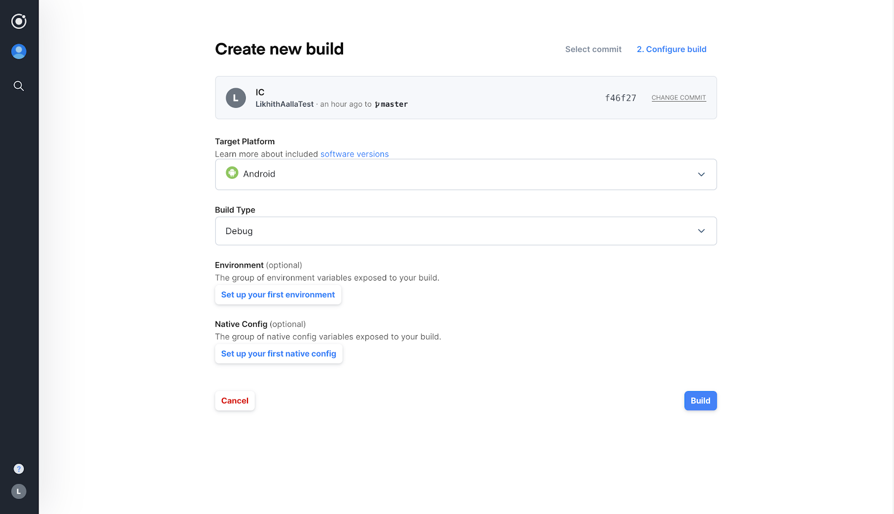
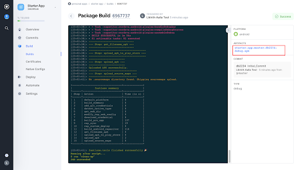

# Exploring Appflow Exercise 2

This part -2 of the exploring Appflow exercise consists of the following topics

1. Building for native 101(android debug)
    1. Build starter app
    2. Package for native
    3. Trigger a Native Binary using Appflow
  
## Building for native 101

In this starter exercise let's build an **Android debug** build, which is the simplest build type with no security profile needed.

### Build starter app

You must build your Ionic project at least once before adding any native platforms.To build the web assets of your starter app 

```
ionic build 
```

This creates the `www` folder that Capacitor has been automatically configured to use as the `webDir` in **`capacitor.config.json`**

Learn more about [Building your Ionic App](https://capacitorjs.com/docs/getting-started/with-ionic#build-your-ionic-app) 

### Package for Native

To package your Starter app for android native platform, use the commands below accordingly. 

> You can add both the platforms for cross-platform application development.

```
npx cap add android
```

This creates an `android/` directory at the root of the project. 

* Capacitor projects include the native platform as a source artifact.These are entirely separate native project artifacts that should be considered part of your Ionic app (i.e., check them  into source control, edit them in their own IDEs, etc.).

Learn more about [Adding platforms](https://capacitorjs.com/docs/getting-started/with-ionic#add-platforms) 

### Building a Native Binary using Appflow

Make sure you commit your project with the latest changes to your Git.

> You can also select from various different combinations of native builds available on Appflow. Refer the docs to know about all the [available build types](https://ionicframework.com/docs/appflow/package/build-types) in Appflow

Now, since you already have done a commit to the Appflow, Click the Start build icon from the Commits tab

  1. Select Android and Debug
  2. Click build



Once, you build starts, you should be able to see the logs from the build instance.

### Download the Starter App

Your Starter App is built and you can download the .apk file file to load it onto your device/simulator of choice to see how it works.




To download the build artifact, click on the above highlighted build artifact link and your download starts.
You can also install the `.apk` file on your simulator or device with development mode on.


You can use this repository to compare your starter project and make changes if necessary.

If you are facing any issues or need help understanding any of these concepts [contact support](support@ionic.io)
